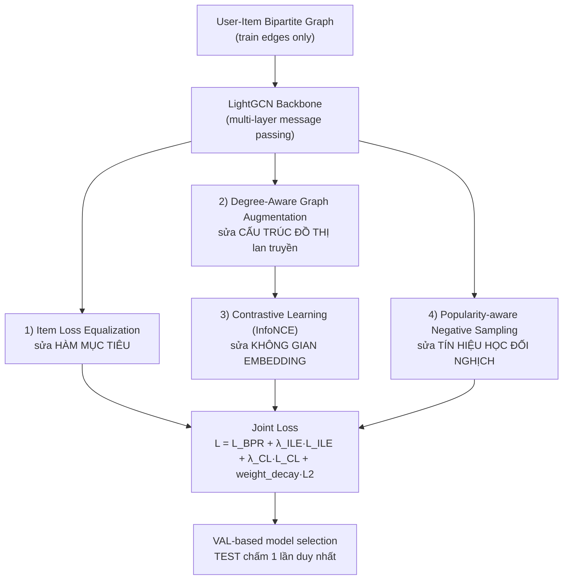
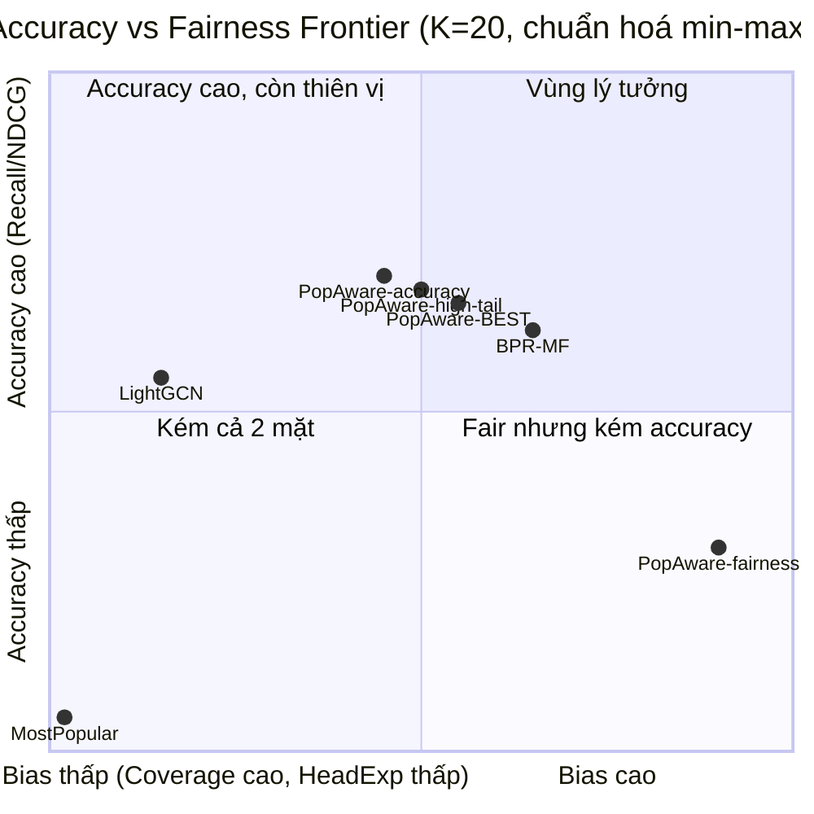

<!-- Slide 5 -->

## Slide 5: Phương pháp đề xuất — Tổng quan kiến trúc

**Popularity-Aware LightGCN** = LightGCN backbone + 4 thành phần bổ sung, có thể bật/tắt độc lập để ablation.



- **Ý tưởng thiết kế:** 4 thành phần tấn công 4 điểm khác nhau trong vòng đời huấn luyện, không phải "cộng dồn nhiều regularizer cho chắc" — nên tác dụng có thể cộng gộp mà không trùng lặp.
- Mỗi thành phần có công tắc `use_ile` / `aug_main` / `use_cl` / `neg_pop_beta` để đo đóng góp riêng.

---

<!-- Slide 6 -->

## Slide 6: Thành phần 1 — Item Loss Equalization (ILE)

**Vấn đề:** BPR loss thường fit item head (phổ biến) tốt hơn hẳn item tail → mô hình nghiêng hẳn về gợi ý item phổ biến.

**Ý tưởng:** phạt độ *chênh lệch* loss trung bình giữa nhóm head và nhóm tail trong mỗi batch.

```
BPR loss từng cặp (pos, neg):
    ℓ(u,i,j) = -log( σ(score(u,i) - score(u,j)) )

Item Loss Equalization:
    L_ILE = ( mean(ℓ | item ∈ head) - mean(ℓ | item ∈ tail) )²
```

- Nhóm popularity xác định theo percentile degree trên **training graph**:
  `tail`: dưới P50 · `middle`: P50–P80 · `head`: trên P80 (bottom 50% / next 30% / top 20%).
- Chỉ tính khi batch có **cả hai** nhóm head và tail (tránh chia cho nhóm rỗng).
- Bình phương → luôn ≥ 0, không lật dấu → **tối thiểu hoá kéo loss(tail) xuống gần loss(head)**, chấp nhận đánh đổi nhẹ ở head.
- *(Lưu ý lịch sử: bản đầu dùng `head_loss - tail_loss` không bình phương → bị lật dấu, đẩy ngược về phía popularity — đã phát hiện và sửa.)*

---

<!-- Slide 7 -->

## Slide 7: Thành phần 2 & 3 — Degree-Aware Graph Augmentation + Contrastive Learning

**Degree-Aware Graph Augmentation:** item càng phổ biến, cạnh của nó càng dễ bị drop khi tạo view augment.

```
p_drop(item) = p_min + (p_max - p_min) · log(1 + deg(item)) / log(1 + deg_max)
```

- Dropout **đối xứng**: quyết định giữ/drop chỉ thực hiện 1 lần trên mỗi cạnh vô hướng user–item, sau đó mirror sang cả hai chiều (user→item và item→user) → đồ thị lan truyền luôn hợp lệ.

**Contrastive Learning (SGL-style, InfoNCE):** 2 view augment của đồ thị được lan truyền qua cùng một encoder LightGCN; embedding của cùng một user/item ở 2 view được kéo lại gần nhau, đẩy xa các user/item khác trong batch.

```
z1, z2 = LightGCN(view1), LightGCN(view2)      # embeddings đã chuẩn hoá
logits = (z1 · z2ᵀ) / τ
L_CL   = CrossEntropy(logits, labels = diagonal)   # positive = cùng chỉ số trong batch
```

- `τ` (temperature) và `λ_CL` kiểm soát độ "cứng" của lực kéo/đẩy.
- Bằng chứng cơ chế đúng: trong sweep, tăng `λ_CL` kéo `Coverage@20` tăng **đơn điệu**.

---

<!-- Slide 8 -->

## Slide 8: Thành phần 4 — Popularity-Aware Negative Sampling

**Ý tưởng:** thay vì lấy negative đều (uniform), lấy negative theo phân phối tỉ lệ với độ phổ biến — item càng phổ biến càng hay bị chọn làm negative → bị đẩy điểm số xuống mạnh hơn.

```
P(neg = item) ∝ deg(item)^β        (β = 0 → uniform, giống sampler gốc)
```

- `β` lớn hơn → phạt item phổ biến mạnh hơn (thực nghiệm dùng `β ∈ {0, 0.5}`).
- Positive vẫn lấy uniform từ train edges (giữ nguyên phân phối positive).
- Có **rejection sampling** (tối đa 20 lần thử lại) để đảm bảo negative không trùng với item mà user đã tương tác trong train.
- Bằng chứng cơ chế đúng: trong sweep, tăng `λ_ILE` kéo `TailRecall@20` tăng **đơn điệu** (0.014 → 0.032 → 0.040) — không phải trùng hợp ngẫu nhiên.

---

<!-- Slide 9 -->

## Slide 9: Hàm mục tiêu tổng hợp & Quy trình huấn luyện/đánh giá

```
L = L_BPR + λ_ILE · L_ILE + λ_CL · L_CL + weight_decay · L2
```

4 thành phần bật/tắt độc lập qua `use_ile`, `aug_main`, `use_cl`, `neg_pop_beta` — cho phép ablation chính xác từng phần.

**Chống rò rỉ dữ liệu (leakage-free protocol):**
- Đồ thị lan truyền **chỉ dùng train edges**; val/test edges không bao giờ tham gia message passing.
- Chọn model (early-stopping, checkpoint tốt nhất) **chỉ dựa trên VAL** Recall@K.
- **TEST chỉ được chấm đúng 1 lần**, ở cuối cùng — không "nhìn trộm" test trong lúc train.

**Hạ tầng huấn luyện (đảm bảo tái lập được):**
- Checkpoint ra đĩa: `<run_id>_latest.pt` (để resume) + `<run_id>_best.pt` (theo VAL).
- Tự động resume từ checkpoint gần nhất nếu bị gián đoạn.
- Log đầy đủ mỗi epoch ra file + stdout; lưu history CSV để vẽ loss curve.
- Đánh giá TEST với đủ 10 metric (`evaluate_full_ranking`).

---

<!-- Slide 10 -->

## Slide 10: Thiết lập thực nghiệm

- **Dataset:** MovieLens-1M, rating ≥ 4 là positive, train/val/test theo leave-one-out mỗi user.
- **Backbone:** LightGCN, `embedding_dim=64`, `num_layers=2` (điểm vận hành chính).
- **Hyperparameter sweep** (`train_sweep_popaware.py`): lưới 24 điểm =
  `num_layers ∈ {2,3} × λ_ILE ∈ {0.1, 0.5, 1.0} × λ_CL ∈ {0.1, 0.5} × β ∈ {0, 0.5}`
  → chọn ra các điểm vận hành theo frontier (accuracy vs fairness).
- **5 cấu hình chốt** (`train_final_seeds.py`), tất cả `num_layers=2`:

  | Cấu hình | λ_ILE | λ_CL | β |
  |---|---|---|---|
  | LightGCN (baseline) | 0 | 0 | 0 |
  | PopAware-accuracy | 0.1 | 0.1 | 0.5 |
  | PopAware-BEST | 1.0 | 0.1 | 0.5 |
  | PopAware-high-tail | 1.0 | 0.1 | 0 |
  | PopAware-fairness | 1.0 | 0.5 | 0 |

- **Độ tin cậy thống kê:** mỗi cấu hình chạy **3 seed** `{42, 0, 1}`, báo cáo mean ± std — tránh chọn "seed đẹp nhất" (winner's curse), so sánh khoảng mean±std có chồng lấn hay không để xác nhận cải thiện là thật.

---

<!-- Slide 11 -->

## Slide 11: Kết quả chính (mean ± std, 3 seed, K=20)

| Model | Recall@20 ↑ | NDCG@20 ↑ | TailRecall@20 ↑ | Coverage@20 ↑ | ARP@20 ↓ | HeadExposure@20 ↓ |
|---|---|---|---|---|---|---|
| LightGCN (baseline) | 0.1287 ± 0.0005 | 0.0497 ± 0.0002 | 0.0050 ± 0.0009 | 0.3978 ± 0.0043 | 6.833 ± 0.009 | 0.9587 ± 0.0006 |
| PopAware-accuracy | 0.1367 ± 0.0035 | 0.0527 ± 0.0006 | 0.0143 ± 0.0023 | 0.4619 ± 0.0289 | 6.500 ± 0.051 | 0.9171 ± 0.0144 |
| **PopAware-BEST** | **0.1338 ± 0.0030** | **0.0518 ± 0.0004** | **0.0324 ± 0.0049** | **0.5384 ± 0.0293** | **6.400 ± 0.042** | **0.8826 ± 0.0114** |
| PopAware-high-tail | 0.1352 ± 0.0020 | 0.0524 ± 0.0004 | 0.0399 ± 0.0023 | 0.4990 ± 0.0099 | 6.564 ± 0.008 | 0.9117 ± 0.0005 |
| PopAware-fairness | 0.1052 ± 0.0039 | 0.0415 ± 0.0011 | 0.0274 ± 0.0035 | 0.7135 ± 0.0027 | 6.138 ± 0.001 | 0.8333 ± 0.0016 |

**Điểm nhấn — PopAware-BEST vs LightGCN:**
- TailRecall@20: **×6.5** (0.0050 → 0.0324)
- Coverage@20: **+35%**
- ARP@20: **−6.3%**, HeadExposure@20: **−7.9%**
- Recall@20: **+4.0%** (tăng, không phải chỉ "không giảm")
- Tất cả khoảng mean±std của baseline và BEST **không chồng lấn** → cải thiện có ý nghĩa thống kê, không phải nhiễu do seed.

---

<!-- Slide 12 -->

## Slide 12: Frontier — đánh đổi Accuracy vs Fairness



- 4 điểm vận hành PopAware tạo thành **một đường frontier có thể chọn**, không phải một điểm cố định như BPR-MF — chọn theo nhu cầu bài toán (ưu tiên accuracy hay ưu tiên fairness).
- Cụm PopAware nằm bên phải LightGCN gốc (Recall cao hơn hẳn) và bên phải BPR-MF theo Recall, nhưng BPR-MF vẫn nhỉnh hơn về Coverage tại điểm balanced.
- `PopAware-fairness` tách hẳn về phía trục fairness — đánh đổi accuracy nhiều nhất để đạt Coverage/HeadExposure tốt nhất.

---

<!-- Slide 13 -->

## Slide 13: Phân tích — Đã đạt kỳ vọng đặt ra ban đầu chưa?

**Đối chiếu 6 kỳ vọng ban đầu với PopAware-BEST (mean±std, 3 seed):**

| Kỳ vọng ban đầu | Kết quả đo được | Đạt? |
|---|---|---|
| TailRecall@20 tăng | 0.0050 → 0.0324 (×6.5, không chồng lấn) | ✅ |
| Coverage@20 tăng | 0.398 → 0.538 (+35%, không chồng lấn) | ✅ |
| ARP@20 giảm | 6.833 → 6.400 (−6.3%, không chồng lấn) | ✅ |
| HeadExposure@20 giảm | 0.9587 → 0.8826 (−7.9%, không chồng lấn) | ✅ |
| Recall/NDCG không giảm mạnh (≤5%) | Recall +4.0%, NDCG tương đương/tăng nhẹ | ✅ (vượt kỳ vọng) |
| TailRecall "chấp nhận được" (không quá thấp/cao) | 0.0324: cao hơn baseline rõ rệt nhưng không cực đoan như high-tail (0.0399) | ✅ |

→ **6/6 tiêu chí đạt**, kể cả khi so với **BPR-MF** (baseline mạnh): BEST vượt về Recall, TailRecall (×2.4), ARP; chỉ thua Coverage — và cấu hình `fairness` áp đảo BPR-MF trên toàn bộ trục fairness.

**Nhìn thẳng — giới hạn còn lại (không tô hồng):**
- Degree-Aware Augmentation và Contrastive Learning dùng **chung tín hiệu** (xác suất drop theo degree) → đóng góp *riêng* của từng thành phần chưa tách bạch, cần ablation ILE-only / Aug-only / CL-only.
- Coverage@20 tại điểm balanced (0.538) **vẫn thấp hơn BPR-MF** (0.628) — graph-based debias chưa chắc hơn MF thuần ở riêng khía cạnh phủ danh mục.
- TailRecall dù cải thiện có ý nghĩa thống kê nhưng **giá trị tuyệt đối còn nhỏ** (~0.03) — nên diễn giải là "giảm đáng kể bias", không phải "đã giải quyết" long-tail.

**Kết luận:** Có — tại điểm vận hành BEST, phương pháp giải quyết đúng vấn đề đặt ra, được xác nhận có ý nghĩa thống kê qua 3 seed, không chỉ dựa trên 1 lần chạy.
